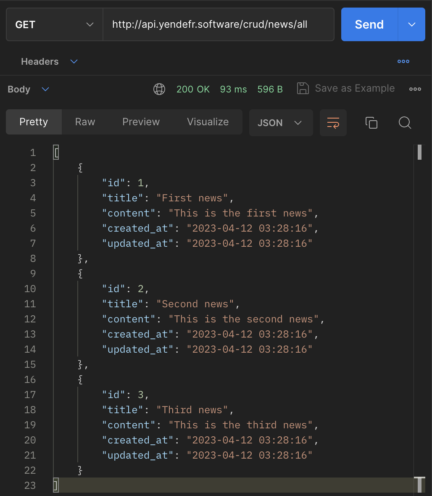
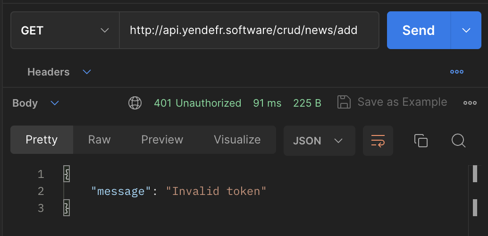
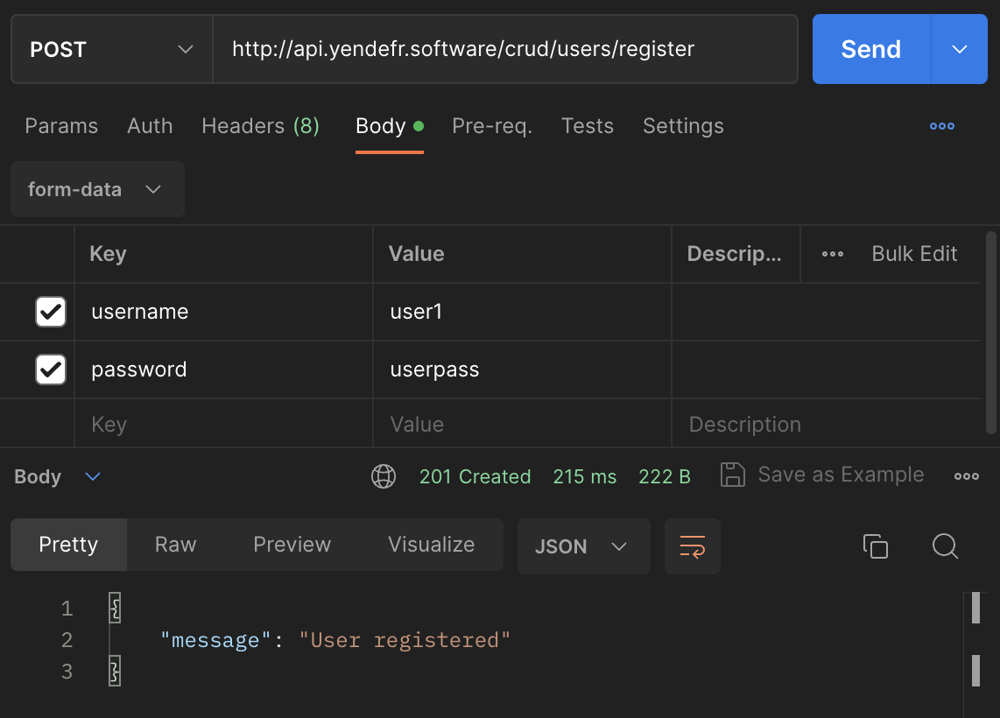
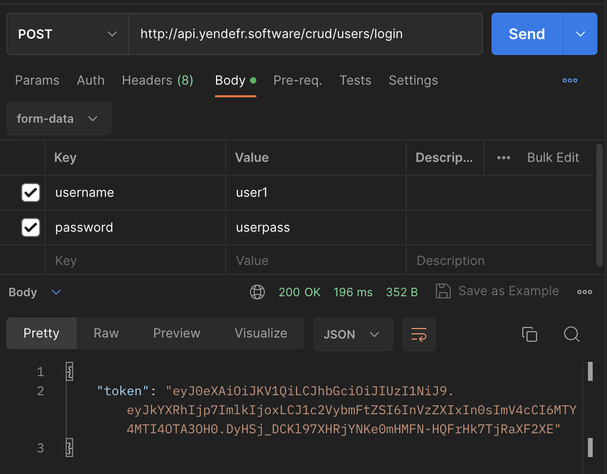
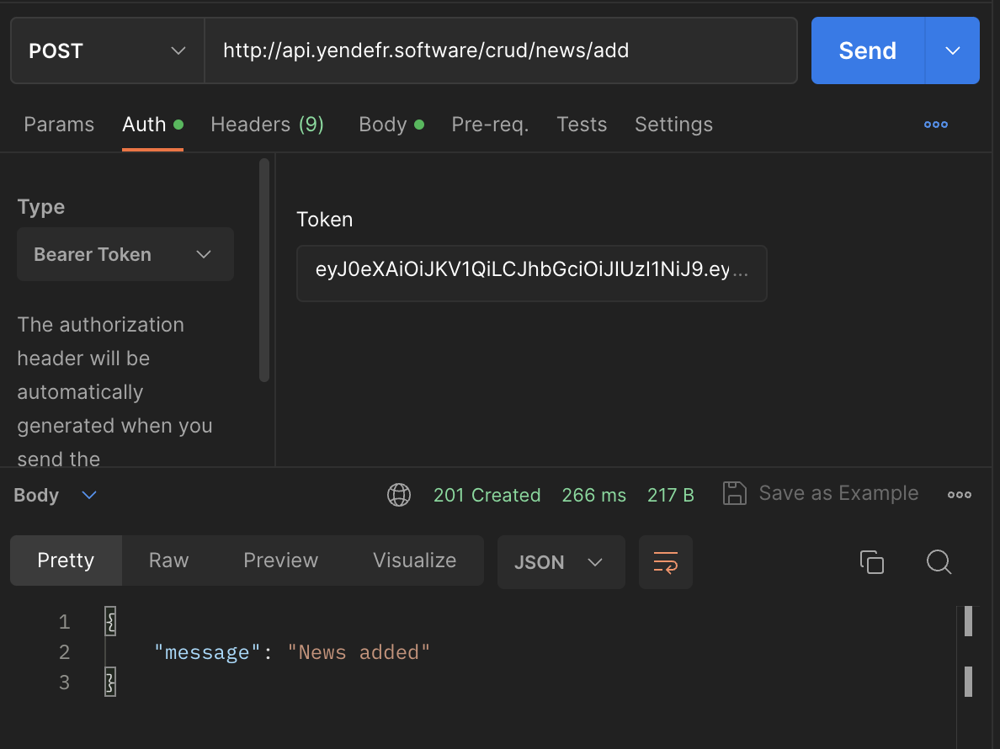
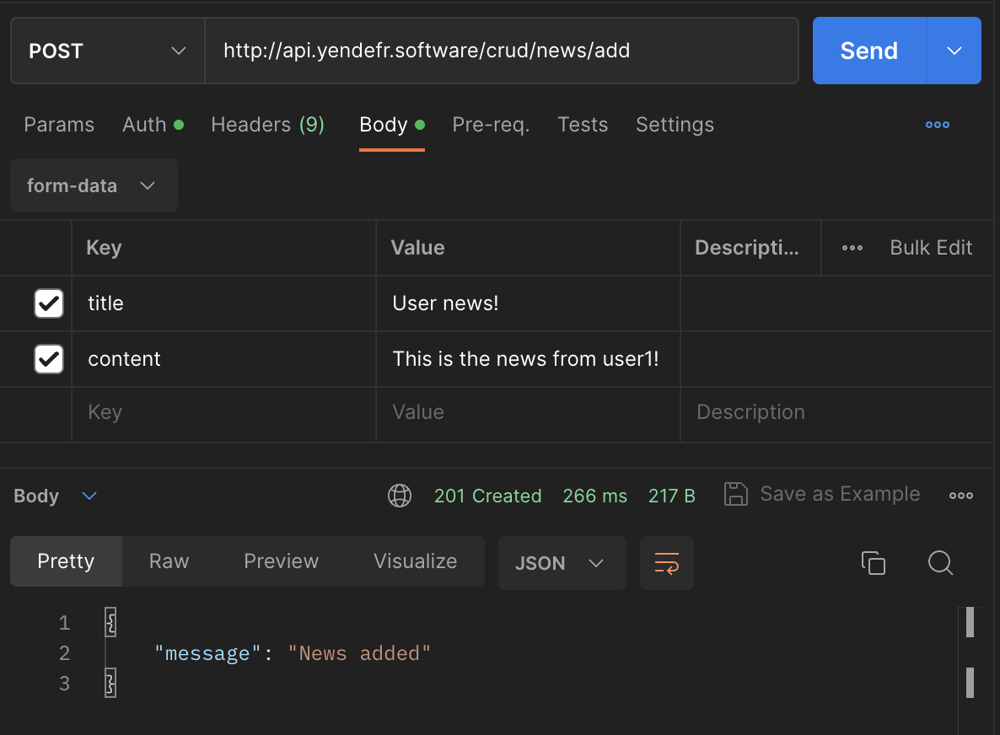
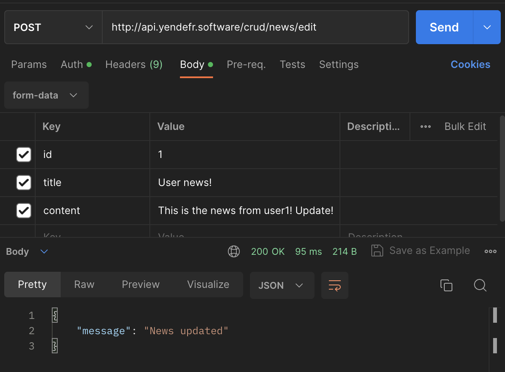
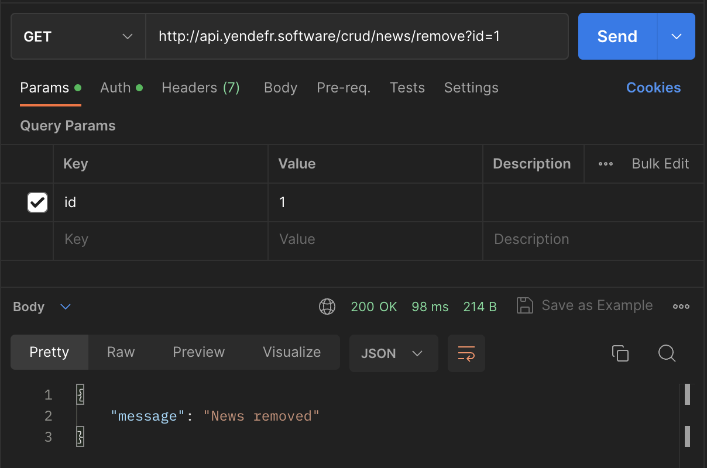

# CRUD с JWT авторизацией

[Демо](http://api.yendefr.software/crud/news/all)

### Чтение статей `/news/all`

### Попытка добавить новость неавторизованным пользователем `/news/add`

### Регистрация пользователя `/users/register`

### Аутентификация пользователя `/users/login`

## Следующие примеры сопровождаются передачей токена с последующей успешной авторизацией

### Добавление статьи `/news/add`

### Редактирование статьи `/news/edit`

### Удаление статьи `/news/remove`

